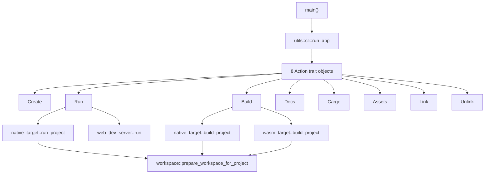
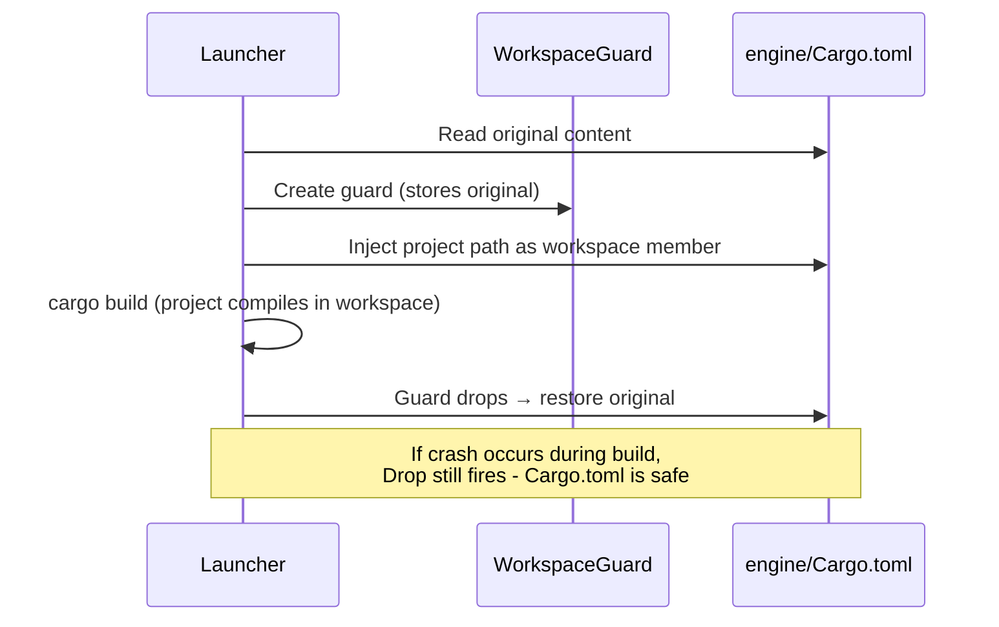
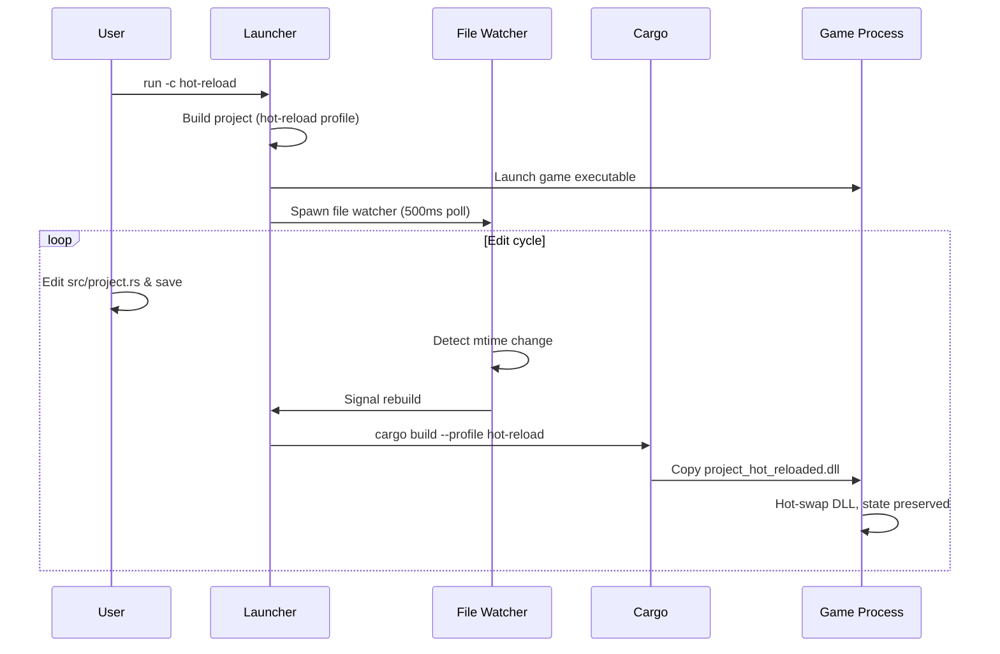
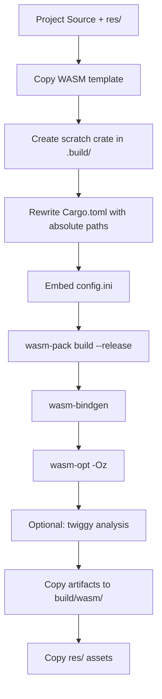
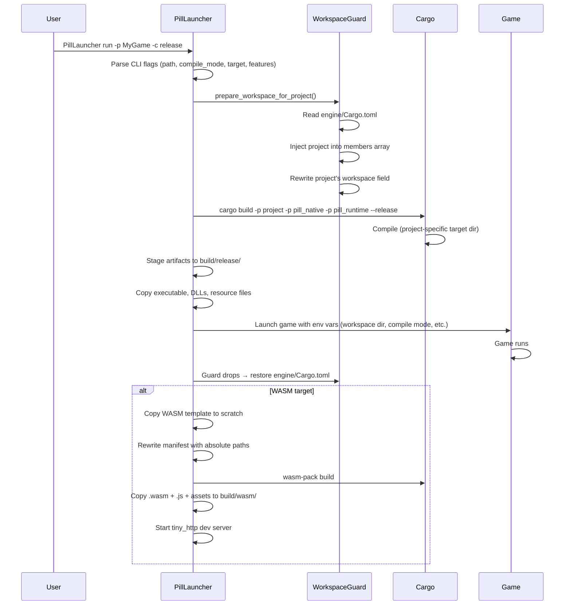

# Pill Launcher - Architecture & Internals

## High-Level Architecture

Pill Launcher is built around a **trait-based action dispatch** system. Each subcommand (`build`, `run`, `create`, etc.) implements the `Action` trait and registers itself with the CLI dispatcher.



**Component responsibilities:**

| Component                 | Role                                                                                          |
| ------------------------- | --------------------------------------------------------------------------------------------- |
| `main.rs`                 | Instantiates 8 action objects, passes to dispatcher                                           |
| `actions/mod.rs`          | Defines the `Action` trait (name, description, register, run)                                 |
| `utils/cli.rs`            | Builds clap CLI from action objects, parses args, dispatches                                  |
| `utils/native_target.rs`  | Builds and runs native executables via cargo                                                  |
| `utils/wasm_target.rs`    | Builds WASM bundles via wasm-pack                                                             |
| `utils/web_dev_server.rs` | Serves WASM builds with live reload                                                           |
| `utils/workspace.rs`      | Manages engine/Cargo.toml workspace membership                                                |
| `utils/assets.rs`         | Delegates to `pill_assets` crate for asset cooking                                            |
| `utils/paths.rs`          | Resolves well-known paths (engine root, crate roots)                                          |
| `utils/common.rs`         | Shared utilities: ANSI colors, cargo error parsing (experimental), timing, filesystem helpers |

## Environment Variables

### User-Facing Variables

These are intended for users to set:

| Variable                          | Purpose                                                                             | Default                             |
| --------------------------------- | ----------------------------------------------------------------------------------- | ----------------------------------- |
| `PILL_LAUNCHER_BIN`               | Override path to launcher binary                                                    | Auto-discovered                     |
| `PILL_LAUNCHER_EXPERIMENTAL_LOGS` | Enable parsed cargo error output (extracts actionable errors from raw cargo stderr) | Disabled                            |
| `PILL_TARGET_DIR`                 | Shared cargo target directory for builds                                            | `engine/target_projects/<project>/` |

### Internal Variables (Set by Launcher)

These are set by the launcher when spawning child processes (game executables). Users normally don't set them directly.

| Variable                    | Set by                            | Purpose                                                |
| --------------------------- | --------------------------------- | ------------------------------------------------------ |
| `PILL_ENGINE_WORKSPACE_DIR` | `run_project()`                   | Tells the game where the engine workspace is           |
| `PILL_HOT_RELOAD_CHILD`     | `run_project()` (hot-reload mode) | Signals that cargo was invoked by a hot-reload rebuild |
| `PILL_COMPILE_MODE`         | `run_project()`                   | The compile mode the game was built with               |
| `PILL_STANDALONE_LAYOUT`    | `run_project()`                   | `development` or `packaged` - controls asset paths     |
| `PILL_ENABLE_HOT_RELOAD`    | `run_project()`                   | `"1"` if hot-reload is active                          |
| `PILL_HEADLESS`             | `run_project()`                   | `"1"` if `--headless` flag was passed                  |
| `PROJECT_DIR`               | `run_project()`                   | Absolute path to the project directory                 |
| `CARGO_TARGET_DIR`          | `build_project_in_workspace()`    | Per-project cargo target directory                     |
| `CARGO_TERM_COLOR`          | `build_project_in_workspace()`    | `"always"` in hot-reload child to preserve colors      |
| `HOME`                      | System                            | Used for cargo bin path lookup during WASM builds      |
| `PATH`                      | System                            | Extended with `.cargo/bin` for WASM tool discovery     |
| `RUSTFLAGS`                 | Launcher (WASM builds)            | `--cfg getrandom_backend="wasm_js"`                    |

## Workspace Guard

The Workspace Guard is a **RAII-based safety mechanism** that ensures `engine/Cargo.toml` is always restored to its original state, even if the launcher crashes.



**Why it exists:** Pill projects and engine crates (`pill_native`, `pill_runtime`) must compile in the same cargo workspace. Without this, Rust's type IDs (used by generics and `TypeId`) would be inconsistent between the project DLL and the engine, causing subtle runtime failures.

**Implementation:**
```rust
pub(crate) struct WorkspaceGuard {
    manifest_path: PathBuf,
    original: String,
}

impl Drop for WorkspaceGuard {
    fn drop(&mut self) {
        let _ = fs::write(&self.manifest_path, &self.original);
    }
}
```

**How it works:**
1. `prepare_workspace_for_project()` reads `engine/Cargo.toml` and stores the original content
2. It injects a line like `"D:/path/to/MyGame", # pill-launcher-managed-workspace-member` into the `members` array
3. It also rewrites the project's own `Cargo.toml` workspace field to point to the engine workspace
4. A `WorkspaceGuard` is returned - its `Drop` implementation writes the original content back
5. For `run_project()`, the guard is held through both build AND execution (the game needs workspace membership for hot-reload child processes)

**Failure recovery:** The `# pill-launcher-managed-workspace-member` comment acts as a sentinel. The CI test infrastructure (`common.sh`) contains `fix_stale_workspace_members()` which removes any line with this marker - if a previous run crashed mid-build, the next run auto-cleans.

### Workspace Preparation Lifecycle

1. **Validation:** Checks the project has `Cargo.toml`, `res/`, `src/`, and `res/config.ini`
2. **Detection:** Reads `engine/Cargo.toml` to find any currently linked project (by sentinel marker)
3. **Switching:** If switching from one project to another, cleans stale build artifacts from `engine/target/<mode>/`
4. **Injection:** Adds the project path to the workspace members array
5. **Project update:** Rewrites the project's `workspace` field to the absolute engine path
6. **Build:** Cargo compiles everything in a unified workspace
7. **Restore:** Guard drops → `engine/Cargo.toml` restored

## Cargo File Modification

The launcher modifies two Cargo.toml files during every build:

**1. `engine/Cargo.toml` - workspace members injection**

Before build:
```toml
members = [
    "pill_abi",
    "pill_core",
    ...
]
```

During build (injected by workspace guard):
```toml
members = [
    "pill_abi",
    "pill_core",
    ...
    "D:/path/to/MyGame", # pill-launcher-managed-workspace-member
]
```

After build (guard drops):
```toml
members = [
    "pill_abi",
    "pill_core",
    ...
]
```

**2. Project `Cargo.toml` - workspace path rewriting**

Before build (template default):
```toml
workspace = "NO_PATH"
```

During build (rewritten to enable workspace membership):
```toml
workspace = "D:/path/to/engine"
```

After build (restored by `WorkspaceGuard`):
```toml
workspace = "NO_PATH"
```

**WASM builds** go further: the `rewrite_scratch_manifest()` function creates a temporary WASM crate, rewriting all `pill_*` dependencies to absolute paths and injecting release optimization profiles (`opt-level = "z"`, `lto = "fat"`, `strip = true`).

## Linking

Linking persists a project into `engine/Cargo.toml`'s workspace members for IDE support:

```bash
PillLauncher link -p MyGame
```

- `rust-analyzer` can then resolve types across engine and project crates
- The marker comment `# pill-launcher-managed-workspace-member` identifies linked entries
- `PillLauncher unlink` removes the entry
- Linking is idempotent - running it twice is harmless

## Hot Reload



**Detection:** A background thread polls `build/hot-reload/` every 500ms for file modification time changes.

**WASM live reload:** The dev server injects a `<script>` into HTML responses that long-polls `/__reload`. When the file watcher detects a rebuild, it notifies all connected browsers to refresh.

## Cache Reuse

- **Per-project target directories**: Each project gets its own cargo target dir under `engine/target_projects/<name>/`. Switching projects doesn't invalidate caches.
- **Shared engine cache**: Engine crates (`pill_engine`, `pill_renderer`, etc.) reuse `engine/target/`.
- **`PILL_TARGET_DIR`**: Setting this env var shares a single target dir across all projects (used by CI for faster incremental builds when testing many examples).
- **`--clean`**: Deletes cooked assets and runs `cargo clean` for the engine workspace before building.
- **Copy-if-newer**: Artifacts (DLLs, executables) are only copied to the output directory if the source is newer than the destination.

## Build Output Structure

```
<project>/
└── build/
    ├── dev/                    ← debug builds (compile mode: debug)
    │   ├── <ProjectName>.exe   ← standalone executable
    │   └── data/
    │       ├── project.dll     ← project code as dynamic library
    │       ├── pill_runtime.dll ← engine runtime library
    │       └── res/            ← cooked assets (release only)
    ├── release/                ← release builds (same layout)
    ├── hot-reload/             ← hot-reload builds
    │   ├── <ProjectName>.exe
    │   └── data/
    │       ├── project_hot_reloaded.dll
    │       └── pill_runtime_hot_reloaded.dll
    └── wasm/                   ← WASM builds
        ├── index.html
        ├── pill_web_app.js
        ├── pill_web_app_bg.wasm
        ├── pill_logo.png
        ├── res/
        └── .build/             ← wasm-pack scratch directory
```

## WASM Build Process



1. The WASM template (`res/templates/wasm/`) is copied to a scratch directory
2. `Cargo.toml` is rewritten with absolute engine paths and release optimization settings
3. The project's `config.ini` is embedded (WASM has no filesystem)
4. `wasm-pack` compiles, runs `wasm-bindgen`, and optimizes with `wasm-opt -Oz`
5. Artifacts are copied to `build/wasm/`
6. Resource files are copied alongside

**Optimization flags** (release WASM):
- `opt-level = "z"` - optimize for size
- `lto = "fat"` - full link-time optimization
- `codegen-units = 1` - maximize optimization potential
- `panic = "abort"` - smaller panic handler
- `strip = true` - strip debug symbols

**Size analysis:** The `--wasm-analyze` flag runs `twiggy` on the final `.wasm` binary, producing a per-function and per-codegen-unit size breakdown. The `--max-wasm-size <KB>` flag (release only) fails the build if the `.wasm` exceeds the given limit.

## Development Web Server

The built-in web server (`web_dev_server.rs`) serves WASM builds during development:

- **Server:** `tiny_http` on `127.0.0.1:<port>` (default 8080)
- **Static files:** Serves everything in `build/wasm/`
- **Live reload:** In hot-reload mode, injects a `<script>` that polls `/__reload`
- **File watcher:** Polls `build/wasm/` every 500ms; notifies subscribers on change
- **Long-poll:** `/__reload` endpoint blocks up to 30s, returns 200 (reload) or 204 (timeout)
- **Security:** Directory traversal prevention via canonicalization checks

## End-to-End Execution Flow



## Example Commands Reference

```bash
# Create a new project
PillLauncher create -n MyGame -p /path/to/parent

# Build native (debug)
PillLauncher build -p MyGame

# Build native (release, clean assets)
PillLauncher build -p MyGame -c release --clean

# Build WASM with size budget and analysis
PillLauncher build -p MyGame -t web -c release --max-wasm-size 500 --wasm-analyze

# Build native with headless mode (CI, benchmarks)
PillLauncher build -p MyGame -c release --headless

# Run with additional features
PillLauncher run -p MyGame -c release --additional-features project/benchmark_windowed

# Run headless (no window)
PillLauncher run -p MyGame -c release --headless

# Run WASM on custom port
PillLauncher run -p MyGame -t web --wasm-port 3000

# Run with passthrough args to game
PillLauncher run -p MyGame -- --benchmark

# Hot-reload development
PillLauncher run -p MyGame -c hot-reload

# Asset pipeline
PillLauncher assets -p MyGame --clean

# Cargo passthrough
PillLauncher cargo -p MyGame -- check
PillLauncher cargo -p MyGame -- clippy
PillLauncher cargo -p MyGame -- fmt --check

# IDE support
PillLauncher link -p MyGame
PillLauncher unlink

# Generate docs
PillLauncher docs -o ./docs_output
```
