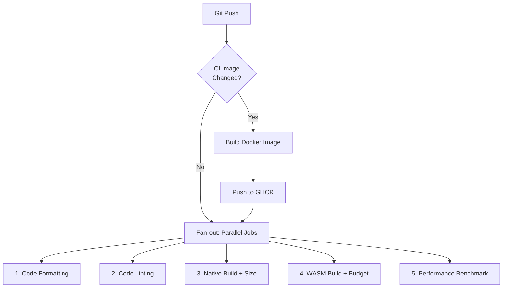

# Continuous Integration Pipeline

## Overview

The Pill CI (Continuous Integration) pipeline is built on **GitHub Actions** and runs in the [MattSzymonski/Pill-Engine](https://github.com/MattSzymonski/Pill-Engine) repository. It automatically validates every code change pushed to the repository - formatting, linting, native builds, WASM builds, binary size tracking, performance benchmarks, and full launcher action tests - to catch regressions before they reach users.

### What Problems It Solves

Pill is a game engine with many moving parts: a launcher CLI, native and WASM build targets, example projects, and an asset pipeline. Manual testing of all combinations is error-prone and time-consuming. The CI pipeline ensures every contributor gets immediate feedback and the `main` branch stays releasable.

| Problem                   | How CI Helps                                                    |
| ------------------------- | --------------------------------------------------------------- |
| Code style drift          | `cargo fmt` enforces consistent formatting on every push        |
| Silent bugs               | `cargo clippy -D warnings` treats all lints as errors           |
| Broken builds             | Every example project is compiled in release mode               |
| WASM size bloat           | Budget check fails if the `.wasm` binary exceeds 0.4999 MB      |
| Performance regressions   | City benchmark runs headlessly, 3× per push                     |
| Launcher regressions      | Full action suite (create/build/run/docs/link) exercised weekly |
| Environment inconsistency | Docker image provides identical build environment everywhere    |

## High-Level Architecture

### Execution Flow



Every push triggers two independent pipelines:

1. **`ci-build-image.yml`** - rebuilds the Docker CI image if the Dockerfile changed, pushes it to GitHub Container Registry (GHCR).
2. **`ci-basic-tests.yml`** - runs 5 fast tests in parallel. Each job pulls the pre-built Docker image (zero setup time), restores cached Rust build artifacts, and executes a test script.

Two additional workflows run on schedules:

3. **`ci-examples-tests.yml`** (daily) - builds all 6 Pill example projects + 2 standalone crates.
4. **`ci-pill_launcher-tests.yml`** (daily) - exhaustive Pill Launcher action tests.

### Relationship Between Workflows and Scripts

```
.github/workflows/ci-basic-tests.yml
    └── runs: bash devops/tests/run_basic_tests.sh <test-name>

.github/workflows/ci-examples-tests.yml
    └── runs: bash devops/tests/run_examples_tests.sh <example-path>

.github/workflows/ci-pill_launcher-tests.yml
    └── runs: bash devops/tests/run_pill_launcher_tests.sh <test-group>
                                     │
                                     ├── source devops/common.sh  (shared helpers)
                                     └── cd $PROJECT_ROOT         (auto-discovered)
```

The YAML workflows define **when** and **where** tests run. The shell scripts define **what** gets tested and **how** results are reported. `common.sh` is the shared library sourced by every script - it provides binary discovery, project-root resolution, stale-file cleanup, size reporting, and colored pass/fail/skip output.

## Repository Structure

```
.github/
└── workflows/
    ├── ci-basic-tests.yml          # Fast checks on every push (5 parallel jobs)
    ├── ci-build-image.yml          # Builds & pushes Docker CI image
    ├── ci-examples-tests.yml       # Daily: build all examples
    └── ci-pill_launcher-tests.yml  # Daily: full Pill Launcher action suite

devops/
├── common.sh                       # Shared library sourced by all test scripts
├── tests/
│   ├── Dockerfile                  # Debian Bookworm-based CI image definition
│   ├── run_basic_tests.sh          # 5 fast checks (fmt, clippy, builds, benchmark)
│   ├── run_examples_tests.sh       # Builds all example projects
│   └── run_pill_launcher_tests.sh  # Exhaustive launcher action tests
└── utils/
    └── generate_documentation.sh   # Standalone rustdoc generation utility
```

## Detailed Test Scripts Documentation

### `run_basic_tests.sh`

| Property          | Detail                                                                                |
| ----------------- | ------------------------------------------------------------------------------------- |
| **Purpose**       | Fast validation of code quality, build integrity, binary size, and performance        |
| **When executed** | Every push (`ci-basic-tests.yml`), or manually via CLI                                |
| **Invocation**    | `bash devops/tests/run_basic_tests.sh [all\|<check-name>]`                            |
| **Prerequisites** | Rust toolchain (cargo, rustfmt, clippy), wasm-pack, git, compiled PillLauncher binary |
| **Exit codes**    | 0 = all checks passed; 1 = one or more checks failed                                  |

**Outputs:** Colored console output with per-step PASS/FAIL/SKIP, binary size JSON reports, benchmark statistics JSON.

#### Code Formatting

Runs `cargo fmt --all` across the engine workspace, then uses `git diff` to detect any files that rustfmt would have changed. The diff excludes `engine/Cargo.toml` and example `Cargo.toml` files - the launcher rewrites workspace paths in these during builds (`NO_PATH` → absolute), so formatting differences there are not real issues.

If `git diff` produces any output, the check fails with:
```
FAIL code formatting - rustfmt produced changes - run 'cargo fmt'
```

#### Code Linting

Runs `cargo clippy --all --manifest-path engine/Cargo.toml -- -D warnings`. All clippy lints are treated as errors - even a single `clippy::needless_borrow` fails the check. This catches dead code, suspicious arithmetic, inefficient patterns, and dozens of other categories before they reach code review.

If clippy exits non-zero, the first 300 characters of output are included in the failure message.

#### Build Native Cube Example + Build Size Report

Compiles `examples/cube` in release mode via `PillLauncher build -p examples/cube -c release --clean`. This validates:

- The launcher can link a project into the engine workspace
- All engine crates (`pill_core`, `pill_engine`, `pill_renderer`, `pill_runtime`, `pill_native`) compile together
- The project compiles as a workspace member and links against engine DLLs
- Artifacts are correctly staged to `build/release/data/`

After a successful build, `print_size_report()` walks `build/release/data/` and emits a JSON snapshot of every file:

```json
{
  "total_mb": 10.6995,
  "file_count": 4,
  "files": [
    {"file": "pill_runtime.dll", "mb": 10.0322},
    {"file": "project.dll",      "mb": 0.3335},
    {"file": "pill_engine.dll",  "mb": 0.3102},
    {"file": "pill_core.dll",    "mb": 0.0236}
  ]
}
```

Sizes are measured in mebibytes (MiB, $1\ \text{MiB} = 1\,048\,576\ \text{bytes}$) to 4 decimal places via `wc -c` + `awk`. The report is printed to the console log - a sudden jump (e.g. `pill_runtime.dll` from ~10 MB to ~15 MB) is immediately visible when reviewing a failed run.

If the build fails (missing dependency, compile error), the check is skipped rather than failed - the build step's own failure already surfaces the problem.

#### Build WASM Cube Example + WASM Size Report + WASM Size Guard

Compiles `examples/cube` for WASM via `PillLauncher build -p examples/cube -t web -c release --clean`. This validates the full WASM pipeline: workspace preparation → cargo build with `wasm32-unknown-unknown` target → `wasm-pack build` → `wasm-bindgen` → `wasm-opt -Oz`.

After the build, the script:

1. **Verifies the `.wasm` artifact** exists at `build/wasm/pill_web_app_bg.wasm`
2. **Measures its size** with `wc -c` and converts to MiB
3. **Enforces a hard budget** - the `.wasm` must not exceed **0.4990 MiB (523 239 bytes)**

If the budget is exceeded:
```
FAIL WASM size budget - 0.5234 MB exceeds 0.4999 MB limit
```

This budget was chosen because the Pill WebGPU runtime, compiled with `opt-level = "z"` + `lto = "fat"` + `wasm-opt -Oz`, fits comfortably under 0.5 MiB. Exceeding it means something significant was added - a new dependency, a codegen regression, or a missing optimization - and needs investigation.

The launcher also supports `--max-wasm-size <KB>` (enforced in `wasm_target.rs`, release only) and `--wasm-analyze` (runs `twiggy` for per-function size breakdown).

**4. Dev server smoke test:** The script starts `PillLauncher run -t web` in the background, waits up to 30 seconds for the server to bind on port 8080, and uses `curl` to verify three key files are served:
- `/` (index.html)
- `/pill_web_app.js`
- `/pill_web_app_bg.wasm`

If any file returns a non-2xx response or the server fails to start, the smoke test fails. This catches cases where the WASM build succeeds but the output is broken or incomplete.

#### Performance Benchmark

The performance benchmark measures frame-time consistency by running `examples/city` - a dense simulation with 10 000 citizens - through 5 000 frames (1 000 warmup, 4 000 measured). The compiled executable self-reports per-frame timing statistics as JSON and auto-exits after the last frame.

**How it works:**

1. **Build once:** `PillLauncher build -p examples/city -c release --clean --headless --additional-features project/benchmark_headless` (or `project/benchmark_windowed` for windowed)
2. **Run 3 times:** The compiled executable is launched directly (bypassing PillLauncher) to avoid launcher overhead in the measurements
3. **Extract JSON:** Each run prints a JSON line with per-frame stats - the script parses `average_ms`, `median_ms`, `min_ms`, `max_ms`, `range_ms`, and `stddev_ms`
4. **Aggregate:** Across the 3 runs, the script computes min, max, and average for each statistic

**Modes:**

| Mode     | Feature flag                 | When used                                                  |
| -------- | ---------------------------- | ---------------------------------------------------------- |
| Windowed | `project/benchmark_windowed` | Windows (always), Linux/macOS when `$DISPLAY` is available |
| Headless | `project/benchmark_headless` | CI/Docker (no display), fallback if GPU init fails         |

The `--headless` launcher flag automatically enables `pill_native/headless`, `pill_runtime/headless`, and `pill_engine/headless` features, while `--additional-features` adds project-level features like `project/benchmark_headless`.

The script auto-detects the environment: Windows uses windowed mode; Linux/macOS checks for `$DISPLAY` / `$WAYLAND_DISPLAY`, tries windowed first, then falls back to headless if the GPU is unavailable.

**Output (per run):**
```json
{"average_ms":1.800,"median_ms":1.700,"min_ms":1.500,"max_ms":2.500,"range_ms":1.000,"stddev_ms":0.200}
```

**Aggregated summary:**
```json
{
  "mode": "headless",
  "runs": 3,
  "stats": {
    "average_ms": {"min": 1.700, "max": 1.900, "avg": 1.800},
    "median_ms":  {"min": 1.600, "max": 1.800, "avg": 1.700},
    "min_ms":     {"min": 1.400, "max": 1.600, "avg": 1.500},
    "max_ms":     {"min": 2.300, "max": 2.800, "avg": 2.500},
    "range_ms":   {"min": 0.900, "max": 1.200, "avg": 1.000},
    "stddev_ms":  {"min": 0.180, "max": 0.220, "avg": 0.200}
  }
}
```

A run is considered passed if at least one of the three iterations completes successfully.

---

### `run_examples_tests.sh`

| Property          | Detail                                                                |
| ----------------- | --------------------------------------------------------------------- |
| **Purpose**       | Verify all Pill example projects compile successfully in release mode |
| **When executed** | Daily schedule (`ci-examples-tests.yml`), or manually                 |
| **Invocation**    | `bash devops/tests/run_examples_tests.sh [all\|<example-path>]`       |
| **Prerequisites** | Rust toolchain, compiled PillLauncher binary                          |

**Examples tested:**

| Type              | Projects                                                                                                        |
| ----------------- | --------------------------------------------------------------------------------------------------------------- |
| Pill projects     | `examples/cube`, `examples/floating_pills`, `examples/italian_brainrot`, `examples/city`, `examples/pill_tunel` |
| Standalone crates | `examples/net_minimal/client`, `examples/net_minimal/server`                                                    |

Each Pill project is built via `PillLauncher build -p <project> -c release`. After each build, `print_size_report()` emits a binary size JSON for the `build/release/data/` directory - the same format as the native build check above. Standalone crates are built directly with `cargo build --release`.

**Outputs:** Per-project build status (PASS/FAIL/SKIP), binary size JSON for each Pill project.

---

### `run_pill_launcher_tests.sh`

| Property          | Detail                                                             |
| ----------------- | ------------------------------------------------------------------ |
| **Purpose**       | Exhaustively test every PillLauncher action and flag combination   |
| **When executed** | Daily schedule + manual dispatch (`ci-pill_launcher-tests.yml`)    |
| **Invocation**    | `bash devops/tests/run_pill_launcher_tests.sh [all\|<test-group>]` |
| **Prerequisites** | Rust toolchain, wasm-pack, compiled PillLauncher binary            |

**Test groups:**

| #   | Group       | What it validates                                                                       |
| --- | ----------- | --------------------------------------------------------------------------------------- |
| 1   | Basics      | `--help`, `--version`, no-args error, unknown subcommand, invalid flags                 |
| 2   | Create      | Scaffold a project, verify file structure, duplicate detection, missing `--name` error  |
| 3   | Build       | Native debug/release/hot-reload, `--clean`, WASM, `--max-wasm-size`, short flags        |
| 4   | Cargo       | Passthrough: `--version`, `check`, `fmt --check`, `clippy`, error on empty/bad commands |
| 5   | Assets      | Asset pipeline (incremental, `--clean`, short flag)                                     |
| 6   | Docs        | `PillLauncher docs -o <dir>`, output directory verification                             |
| 7   | Run         | Native debug/release/hot-reload, `--clean`, WASM, `--wasm-port`, passthrough args       |
| 8   | Hot-reload  | Start in background, touch source file, verify process survives                         |
| 9   | Link/Unlink | Add/remove project from engine workspace members, idempotency                           |

Tests use a temporary workspace under `$TMPDIR/pill-ci-tests-*`. Scaffolded projects are created, built, and discarded. Native run tests use `timeout 10s` to prevent hanging. Tests **skip rather than fail** when optional tooling is missing (WASM, PlantUML) - the CI Docker image has all tools pre-installed, so skips only occur in local development.

**Outputs:** Detailed PASS/FAIL/SKIP per test case, summary with counts.

---

### `common.sh` (shared library)

| Property          | Detail                                                                                                                                                                                                                     |
| ----------------- | -------------------------------------------------------------------------------------------------------------------------------------------------------------------------------------------------------------------------- |
| **Purpose**       | Shared infrastructure sourced by all test scripts                                                                                                                                                                          |
| **Key functions** | `find_project_root`, `find_launcher`, `fix_stale_workspace_members`, `print_size_report`, `kill_server_on_port`, `report_pass`/`report_fail`/`report_skip`, `invoke_launcher`, `assert_ok`, `assert_fail`, `print_summary` |
| **Key variables** | `$PROJECT_ROOT`, `$pill_launcher_bin`, `$test_workspace_root`                                                                                                                                                              |

## Docker Support

Each GitHub Actions job runs in a fresh virtual machine. Installing Rust, system libraries (`libasound2`, `libudev`), Slang shader compiler, PlantUML, and wasm-pack takes 2–3 minutes per job. By pre-building all dependencies into a Docker image, setup time drops to ~5 seconds per job (just pulling cached layers).

### The CI Image

Defined in `devops/tests/Dockerfile`:

- **Base:** `rust:1.92-slim-bookworm` (Debian Bookworm, glibc)
- **System packages:** `mold` (fast linker), `clang` (C linker), `libasound2-dev` (audio), `libudev-dev` (gamepad), `pkg-config`, `plantuml`, `curl`, `git`, `ca-certificates`
- **Rust components:** `rustfmt`, `clippy`, `wasm32-unknown-unknown` target
- **Tools:** `wasm-pack` (v0.13.1), Slang shader compiler (`slangc` v2025.21.2)

**Entrypoint:** On container start, the entrypoint script:
1. Touches `.wgsl` shader files so `build.rs` skips HLSL→WGSL conversion
2. Fixes any absolute host paths in `engine/Cargo.toml` (left over from Windows builds)

PillLauncher itself is pre-compiled into the image — see [Prebuilt Pill Launcher](#prebuilt-pill-launcher) below.

The image is rebuilt automatically when the Dockerfile changes and pushed to `ghcr.io/mattszymonski/pill-ci:latest`.

## Prebuilt Pill Launcher

The CI Docker image uses a **multi-stage build** that compiles PillLauncher during `docker build` and bakes the binary directly into the image. This eliminates the ~20-second launcher compilation step that used to run on every container start.

**How it works:**

1. **Stage 1 (builder):** Copies the `engine/` source into a Rust container, runs `cargo build --release` for `pill_launcher`, and produces the binary at a known path.
2. **Stage 2 (runtime):** Copies only the compiled `PillLauncher` binary from Stage 1 into `/usr/local/bin/PillLauncher` and sets `ENV PILL_LAUNCHER_BIN=/usr/local/bin/PillLauncher`.
3. **At container start:** The entrypoint script no longer builds anything — it only touches WGSL shaders and fixes stale Cargo.toml paths (both instant operations).
4. **Test scripts:** `common.sh` reads `$PILL_LAUNCHER_BIN` first, so all test scripts discover the pre-built binary immediately with zero setup time.

**When the image rebuilds:** The `ci-build-image.yml` workflow triggers whenever the Dockerfile, the PillLauncher source (`engine/pill_launcher/**`), or the workflow itself changes. This ensures the baked-in binary is always up to date with the latest launcher code.

**Result:** Container startup went from ~20s (launcher build) to <1s (path fixup only). Tests begin executing immediately after the image is pulled.

## Running the Pipeline Locally

### Windows

**Prerequisites:**
- Git Bash (included with Git for Windows)
- Rust toolchain: `https://rustup.rs`
- wasm-pack: `cargo install wasm-pack`
- Python 3 (for `http.server` - optional, dev server smoke test tries PillLauncher first)

**Setup:**
```bash
# Clone and enter repo
git clone https://github.com/MattSzymonski/Pill-Engine
cd Pill-Engine

# Build the launcher (required by all test scripts)
cargo build --release --manifest-path engine/pill_launcher/Cargo.toml
```

**Run all fast checks:**
```bash
cd devops
bash tests/run_basic_tests.sh
```

**Run a single check:**
```bash
bash tests/run_basic_tests.sh build_wasm_cube_example
```

**Build all examples:**
```bash
bash tests/run_examples_tests.sh
```

**Expected output:** Colored PASS/FAIL/SKIP lines, ending with a summary table and exit code (0 = success).

**Common issues:**
- `PillLauncher binary not found` → Build it with the cargo command above
- `cargo metadata` errors → Run `cargo fmt` once to fix stale workspace paths, or let `common.sh` auto-fix them
- Port 8080 in use → `taskkill /F /IM PillLauncher.exe`

### Linux

**Prerequisites:**
```bash
sudo apt-get install -y pkg-config libasound2-dev libudev-dev plantuml mold clang curl
# Install Rust: https://rustup.rs
cargo install wasm-pack
```

**Setup & run:**
```bash
git clone https://github.com/MattSzymonski/Pill-Engine
cd Pill-Engine

# Build the launcher (required by all test scripts)
cargo build --release --manifest-path engine/pill_launcher/Cargo.toml

# Run tests from devops directory
bash devops/tests/run_basic_tests.sh
```

**Headless benchmarking:** The performance benchmark auto-detects missing `$DISPLAY` and `$WAYLAND_DISPLAY`, then uses `--headless` mode. No xvfb needed.

### macOS

The pipeline is **not officially tested on macOS**. The test scripts should work with Homebrew-installed dependencies (`pkg-config`, `alsa-lib` may not be available). Native builds may fail due to missing Linux-specific libraries. Docker is the recommended approach for macOS.

### Running in Docker

The Docker image provides an identical environment to CI, ensuring reproducible results.

**Linux:**
```bash
docker run --rm -v "$PWD:/src" -w /src \
    ghcr.io/mattszymonski/pill-ci:latest \
    bash devops/tests/run_basic_tests.sh
```

**Windows (PowerShell):**
```powershell
docker run --rm -v "${PWD}:/src" -w /src `
    ghcr.io/mattszymonski/pill-ci:latest `
    bash devops/tests/run_basic_tests.sh
```

**Windows (CMD):**
```cmd
docker run --rm -v "%cd%:/src" -w /src ghcr.io/mattszymonski/pill-ci:latest bash devops/tests/run_basic_tests.sh
```

**macOS:**
```bash
docker run --rm -v "$PWD:/src" -w /src \
    ghcr.io/mattszymonski/pill-ci:latest \
    bash devops/tests/run_basic_tests.sh
```

**What each flag does:**
- `--rm` - remove container after exit
- `-v "$PWD:/src"` - mount current directory as `/src` inside container
- `-w /src` - set working directory
- `ghcr.io/mattszymonski/pill-ci:latest` - pre-built CI image with PillLauncher already compiled
- Remaining args - the test script to run

**Building the image locally (optional):**
```bash
# Linux / macOS / Git Bash
docker build -t pill-ci -f devops/tests/Dockerfile .
docker run --rm -v "$PWD:/src" -w /src pill-ci bash devops/tests/run_basic_tests.sh
```
```powershell
# Windows PowerShell
docker build -t pill-ci -f devops/tests/Dockerfile .
docker run --rm -v "${PWD}:/src" -w /src pill-ci bash devops/tests/run_basic_tests.sh
```
```cmd
REM Windows CMD
docker build -t pill-ci -f devops/tests/Dockerfile .
docker run --rm -v "%cd%:/src" -w /src pill-ci bash devops/tests/run_basic_tests.sh
```

**Note for Windows users:** PillLauncher is pre-compiled into the image at `/usr/local/bin/PillLauncher` — no runtime compilation occurs. The previous "Text file busy" issue (caused by building the launcher on a Windows-mounted volume) is eliminated.

## Understanding the Results

### Console Output

Every test result is printed as:

```
  PASS <description>
  FAIL <description> - <reason>
  SKIP <description> - <reason>
```

- **PASS** - the check succeeded
- **FAIL** - the check failed; the reason explains what went wrong
- **SKIP** - the check could not run (missing dependency, tool not installed, etc.)

After all checks, a summary table is printed:

```
========================================
(1/8) PASS - code formatting
(2/8) PASS - code linting
...
========================================
Results: 6 passed, 1 failed, 1 skipped (8 total)
========================================
```

### Binary Size Reports

Build steps output JSON reports like:

```json
{
  "total_mb": 10.6995,
  "file_count": 4,
  "files": [
    {"file": "pill_runtime.dll", "mb": 10.0322},
    {"file": "project.dll", "mb": 0.3335}
  ]
}
```

### Benchmark Output

The performance benchmark produces per-run statistics:

```json
{
  "mode": "headless",
  "runs": 3,
  "stats": {
    "average_ms": {"min": 1.700, "max": 1.900, "avg": 1.800},
    ...
  }
}
```

### Exit Codes

| Code | Meaning                   |
| ---- | ------------------------- |
| 0    | All checks passed         |
| 1    | One or more checks failed |

## GitHub Actions Integration

### Workflows

| Workflow                     | Trigger                         | Container                    | What it does                    |
| ---------------------------- | ------------------------------- | ---------------------------- | ------------------------------- |
| `ci-basic-tests.yml`         | Every push                      | `ghcr.io/.../pill-ci:latest` | 5 fast checks in parallel       |
| `ci-build-image.yml`         | Dockerfile changes, manual      | None (builds image)          | Builds & pushes CI Docker image |
| `ci-examples-tests.yml`      | Daily 03:30 UTC, manual         | `ghcr.io/.../pill-ci:latest` | Builds all 8 examples           |
| `ci-pill_launcher-tests.yml` | Weekly Sunday 04:00 UTC, manual | `ghcr.io/.../pill-ci:latest` | Full launcher action suite      |

### How They Invoke Test Scripts

All workflows follow the same pattern:
1. Checkout code
2. Download pre-built PillLauncher artifact to `engine/pill_launcher/target/release/`
3. Set `PILL_LAUNCHER_BIN` implicitly via the artifact path (which `common.sh` discovers)
4. Run: `bash devops/tests/<script>.sh <check-name>`

### Failure Reporting

Failures appear as:
- Red ✗ in the GitHub Actions UI
- `FAIL` lines in the workflow log
- The workflow exits with code 1, which GitHub marks as failed

### Debugging Failed Runs

1. Go to **Actions** tab on GitHub
2. Click the failed workflow run
3. Expand the failed job
4. Read the step output - `FAIL` lines explain what went wrong
5. Download artifacts (PillLauncher binary, build logs) if available

### Artifacts

The `build_launcher` job uploads `PillLauncher` as an artifact named `pilllauncher-linux`. This is downloaded by all downstream jobs. Developers can download it from the workflow run page for local debugging.

## Example Workflows

### Run All Tests Locally

```bash
cd devops
bash tests/run_basic_tests.sh
```

### Run a Single Check

```bash
bash tests/run_basic_tests.sh code_formatting_check
bash tests/run_basic_tests.sh build_wasm_cube_example
bash tests/run_pill_launcher_tests.sh create
```

### Run Inside Docker

```bash
# Linux / macOS / Git Bash
docker run --rm -v "$PWD:/src" -w /src \
    ghcr.io/mattszymonski/pill-ci:latest \
    bash devops/tests/run_basic_tests.sh
```

```powershell
# Windows PowerShell
docker run --rm -v "${PWD}:/src" -w /src `
    ghcr.io/mattszymonski/pill-ci:latest `
    bash devops/tests/run_basic_tests.sh
```

```cmd
REM Windows CMD
docker run --rm -v "%cd%:/src" -w /src ghcr.io/mattszymonski/pill-ci:latest bash devops/tests/run_basic_tests.sh
```

### Debug a Failing Test

```bash
# Run just the failing check with verbose output
bash tests/run_basic_tests.sh benchmark_native_performance

# Check if the launcher binary is valid
file engine/pill_launcher/target/release/PillLauncher
engine/pill_launcher/target/release/PillLauncher --version

# Compare local vs CI by running in Docker
# Linux / macOS / Git Bash:
docker run --rm -v "$PWD:/src" -w /src \
    ghcr.io/mattszymonski/pill-ci:latest \
    bash devops/tests/run_basic_tests.sh
# Windows CMD:
docker run --rm -v "%cd%:/src" -w /src ghcr.io/mattszymonski/pill-ci:latest bash devops/tests/run_basic_tests.sh
```

### Generate Documentation

```bash
cd devops
bash utils/generate_documentation.sh           # → ../docs/generated/
bash utils/generate_documentation.sh -o /tmp/d # → /tmp/d/generated/
```
